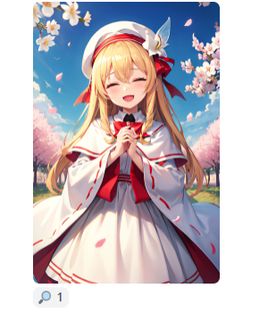
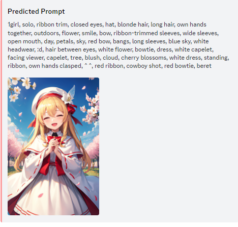

# PI-Chan
Get prompts/descriptions of images uploaded on discord.

# You can add PI-Chan into your server without hosting!
[this](https://discord.com/oauth2/authorize?client_id=1159983729591210004)

## Functionality

This Discord bot reacts to any image with generation metadata from the most/all popular webuis. (Create an issue if your favorite webui doesn't have it!)
If you want to get a *rough* prompt (predicted with wdtagger), react with ❔

Install [this](https://github.com/ashen-sensored/sd_webui_stealth_pnginfo) if it breaks!

## Setup

1. Clone the repository
2. Install the dependencies with `pip install -r requirements.txt`
3. Create a Discord bot and invite it to your server
4. Enable the `Message Content Intent` in the Discord developer portal
5. Enable the `Server Members Intent` in the Discord developer portal
6. Copy/rename the `config.base.toml` into `config.toml`
7. Set `TOKEN = "<your discord bot token>"` in the .toml file
8. So like `TOKEN = "HFBVSAOa876vat764bq8967fgh8d8a76"`
9. Add the channel IDs you want the bot to work in into the `config.toml` file
10.  Run the bot with `python3 PromptInspector.py`

## Examples

## Webui Support

|              Webui             | Supported? |
|:------------------------------:|:----------:|
|      Automatic 1111-likes      |      ✅     |
|             ComfyUI            |     🟨*     |
|             SwarmUI            |      ✅     |
|             NovelAI            |      ✅     |
|             Fooocus            |     ✅**    |

*It returns the workflow and tries to extract the prompt, loras and checkpoints used

**Please test in TouhouAI, I think it will work though
